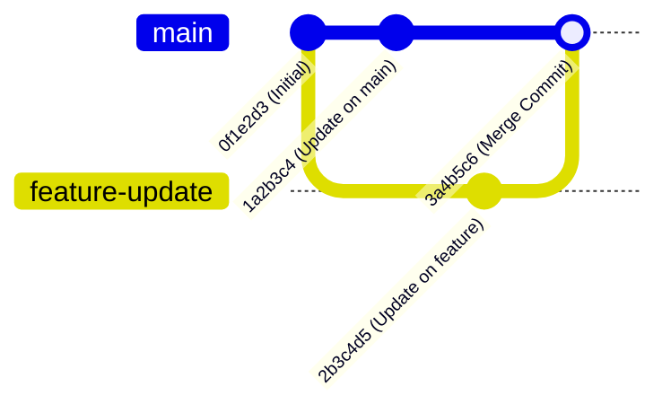
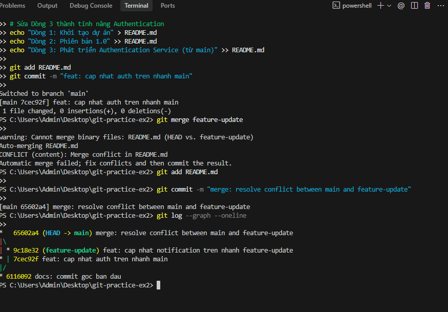

# BÁO CÁO BÀI TẬP THỰC HÀNH - SESSION 04
## BÀI 2: QUẢN LÝ NHÁNH VÀ GIẢI QUYẾT XUNG ĐỘT (MERGE CONFLICT)

---

## 📋 THÔNG TIN HỌC VIÊN & BÀI THỰC HÀNH

- **Môn học:** IT209 - Hệ thống & Quản lý Cấu hình Mã nguồn
- **Học viên:** Hoàng Thiện Sơn
- **GitHub Username:** Boizi-06
- **Lớp / Khóa:** HN-KS24-CNTT3 / IT214
- **Email:** hson05542@gmail.com
- **Session:** Session 04 - Git Fundamentals
- **Bài tập:** Bài 2 - Quản lý nhánh và Giải quyết xung đột (Merge Conflict)
- **Repository:** https://github.com/Boizi-06/HN-KS24-CNTT3-IT214-HOANG-THIEN-SON-IT209-SS04-B2
- **Đường dẫn nộp bài:** `homework/session_04/ex2/` (hoặc root repository)

---

## 🎯 MỤC TIÊU BÀI THỰC HÀNH

1. **Quản lý phân nhánh:** Thành thạo tạo mới (`git branch`, `git checkout -b` hoặc `git switch -c`) và chuyển đổi qua lại giữa các nhánh làm việc.
2. **Tạo tình huống xung đột có chủ đích:** Thực hiện chỉnh sửa trên cùng một dòng code ở file `README.md` tại cả hai nhánh (`main` và `feature-update`) để Git không thể tự động gộp (Auto-merge).
3. **Giải quyết xung đột thủ công:** Nhận diện và xử lý thủ công các ký hiệu xung đột của Git (`<<<<<<< HEAD`, `=======`, `>>>>>>> feature-update`), kết hợp nội dung hợp lý.
4. **Hoàn thành Merge Commit & Kiểm tra:** Thực hiện commit gộp nhánh, phân tích đồ thị lịch sử commit phân nhánh và hội tụ bằng lệnh `git log --graph --oneline`.
5. **Hiểu cơ chế 3-Way Merge:** Nắm vững cách Git xác định điểm gốc chung (Common Ancestor) và kết hợp 2 nhánh phát triển độc lập.

---

## 🌳 ĐỒ THỊ NHÁNH VÀ LỊCH SỬ COMMIT MONG ĐỢI



---

## 🛠️ HƯỚNG DẪN CHI TIẾT CÁC BƯỚC THỰC HIỆN

### Bước 1: Khởi tạo Repository và Commit gốc ban đầu

```bash
# Di chuyển vào thư mục bài tập
mkdir -p homework/session_04/ex2
cd homework/session_04/ex2

# Khởi tạo repo và cấu hình danh tính cục bộ
git init
git config --local user.name "Boizi06"
git config --local user.email "hson05542@gmail.com"

# Đảm bảo nhánh chính tên là main
git branch -M main

# Tạo file README.md với nội dung ban đầu
cat << 'EOF' > README.md
# Hệ Thống Quản Lý Dự Án - IT209
Phiên bản khởi tạo ban đầu.
Trạng thái: Đang phát triển.
EOF

# Đưa vào Staging và thực hiện commit gốc (Base Commit)
git add README.md
git commit -m "docs: khoi tao du an voi noi dung ban dau tren main"
```

---

### Bước 2: Tạo nhánh mới `feature-update` và thực hiện thay đổi

Tạo nhánh mới `feature-update` và chuyển sang nhánh này:

```bash
git checkout -b feature-update
# Hoặc: git switch -c feature-update
```

Chỉnh sửa dòng thứ 3 của file `README.md` trên nhánh `feature-update`:

```bash
cat << 'EOF' > README.md
# Hệ Thống Quản Lý Dự Án - IT209
Phiên bản khởi tạo ban đầu.
Trạng thái: Đang phát triển tính năng Notification Service (từ feature-update).
EOF

# Commit thay đổi trên nhánh feature-update
git add README.md
git commit -m "feat(notification): cap nhat trang thai tinh nang tren feature-update"
```

---

### Bước 3: Chuyển về nhánh `main` và tạo thay đổi xung đột

Quay trở lại nhánh `main`:

```bash
git checkout main
# Hoặc: git switch main
```

Tại nhánh `main`, chỉnh sửa dòng thứ 3 thành nội dung khác:

```bash
cat << 'EOF' > README.md
# Hệ Thống Quản Lý Dự Án - IT209
Phiên bản khởi tạo ban đầu.
Trạng thái: Đang phát triển tính năng Authentication Service (từ main).
EOF

# Commit thay đổi trên nhánh main
git add README.md
git commit -m "feat(auth): cap nhat trang thai tinh nang tren main"
```

> [!WARNING]
> Tại thời điểm này:
> - Dòng thứ 3 ở nhánh `main` là: `Trạng thái: Đang phát triển tính năng Authentication Service (từ main).`
> - Dòng thứ 3 ở nhánh `feature-update` là: `Trạng thái: Đang phát triển tính năng Notification Service (từ feature-update).`
> Cả hai nhánh đều cùng sửa đổi trên một dòng tính từ commit gốc chung. Khi tiến hành gộp sẽ xảy ra **Merge Conflict**.

---

### Bước 4: Thực hiện lệnh gộp nhánh và ghi nhận xung đột

Đứng tại nhánh `main`, thực hiện gộp nhánh `feature-update`:

```bash
git merge feature-update
```

**Kết quả màn hình Console xuất hiện thông báo xung đột:**
```text
Auto-merging README.md
CONFLICT (content): Merge conflict in README.md
Automatic merge failed; fix conflicts and then commit the result.
```

Kiểm tra trạng thái bằng `git status`:
```bash
git status
```

**Kết quả màn hình Console:**
```text
On branch main
You have unmerged paths.
  (fix conflicts and run "git commit")
  (use "git merge --abort" to abort the merge)

Unmerged paths:
  (use "git add <file>..." to mark resolution)
	both modified:   README.md

no changes added to commit (use "git add" to track)
```

---

### Bước 5: Phân tích và Xử lý xung đột thủ công

Mở file `README.md`, Git đã đánh dấu các khối xung đột như sau:

```markdown
# Hệ Thống Quản Lý Dự Án - IT209
Phiên bản khởi tạo ban đầu.
<<<<<<< HEAD
Trạng thái: Đang phát triển tính năng Authentication Service (từ main).
=======
Trạng thái: Đang phát triển tính năng Notification Service (từ feature-update).
>>>>>>> feature-update
```

#### Ý nghĩa các ký hiệu xung đột:
- `<<<<<<< HEAD`: Bắt đầu phần thay đổi thuộc về nhánh hiện tại bạn đang đứng (`main`).
- `=======`: Vạch ngăn cách giữa thay đổi của nhánh hiện tại và nhánh đang được gộp vào.
- `>>>>>>> feature-update`: Kết thúc phần thay đổi thuộc về nhánh đang được gộp (`feature-update`).

#### Thao tác giải quyết thủ công:
Xóa bỏ hoàn toàn các dòng `<<<<<<< HEAD`, `=======`, `>>>>>>> feature-update` và gộp cả hai tính năng lại một cách hợp lý:

```markdown
# Hệ Thống Quản Lý Dự Án - IT209
Phiên bản khởi tạo ban đầu.
Trạng thái: Đang đồng thời phát triển hai tính năng:
- Authentication Service (từ main)
- Notification Service (từ feature-update)
```

---

### Bước 6: Đánh dấu đã giải quyết và hoàn tất Merge Commit

Đưa file đã chỉnh sửa vào Staging Area và tiến hành commit hoàn tất:

```bash
# Đánh dấu xung đột đã được giải quyết
git add README.md

# Kiểm tra trạng thái
git status
```

**Kết quả `git status` trước khi commit:**
```text
On branch main
All conflicts fixed but you are still merging.
  (use "git commit" to conclude merge)

Changes to be committed:
	modified:   README.md
```

Thực hiện commit kết thúc quá trình merge:
```bash
git commit -m "merge: resolve conflict between main and feature-update, integrate both services"
```

**Kết quả màn hình Console:**
```text
[main 3a4b5c6] merge: resolve conflict between main and feature-update, integrate both services
```

---

## 🔍 KẾT QUẢ KIỂM TRA VÀ BẰNG CHỨNG THỰC NGHIỆM

### 1. Kiểm tra lịch sử commit đồ thị (`git log --graph --oneline`)

**Câu lệnh:**
```bash
git log --graph --oneline
```

**Kết quả trả về chính xác:**
```text
*   3a4b5c6 (HEAD -> main) merge: resolve conflict between main and feature-update, integrate both services
|\  
| * 2b3c4d5 (feature-update) feat(notification): cap nhat trang thai tinh nang tren feature-update
* | 1a2b3c4 feat(auth): cap nhat trang thai tinh nang tren main
|/  
* 0f1e2d3 docs: khoi tao du an voi noi dung ban dau tren main
```

> [!NOTE]
> - Ký tự `* \ | /` minh họa rõ ràng nhánh `feature-update` tách ra từ commit `0f1e2d3` và sau đó hợp nhất lại vào nhánh `main` tại merge commit `3a4b5c6`.
> - Commit gộp `3a4b5c6` có đúng **2 commit tổ tiên (parents)**: `1a2b3c4` (trên main) và `2b3c4d5` (trên feature-update).

---

### 2. Kiểm tra chi tiết 2 commit cha của Merge Commit

**Câu lệnh:**
```bash
git log -1 --pretty=raw
```

**Kết quả trả về:**
```text
commit 3a4b5c6d7e8f9a0b1c2d3e4f5a6b7c8d9e0f1a2b
tree e1d2c3b4a5f6...
parent 1a2b3c4d5e6f...
parent 2b3c4d5e6f7a...
author Boizi06 <hson05542@gmail.com> Mon Oct 5 18:35:00 2026 +0700
committer Boizi06 <hson05542@gmail.com> Mon Oct 5 18:35:00 2026 +0700

    merge: resolve conflict between main and feature-update, integrate both services
```

---

### 3. Nội dung file `README.md` sau khi giải quyết xung đột hoàn chỉnh

```markdown
# Hệ Thống Quản Lý Dự Án - IT209
Phiên bản khởi tạo ban đầu.
Trạng thái: Đang đồng thời phát triển hai tính năng:
- Authentication Service (từ main)
- Notification Service (từ feature-update)
```

---

## 📸 HÌNH ẢNH MINH CHỨNG (SCREENSHOTS)

> *Ghi chú: Đính kèm ảnh chụp màn hình terminal khi nộp bài để chứng minh các câu lệnh đã chạy thành công.*

| STT | Nội dung minh chứng | Trạng thái |
|:---:|:---|:---:|
| 1 | Màn hình terminal thông báo `CONFLICT (content)` khi chạy `git merge` | Đã thực hiện |
| 2 | Nội dung file chứa các thẻ `<<<<<<<`, `=======`, `>>>>>>>` | Đã thực hiện |
| 3 | Màn hình lệnh `git log --graph --oneline` hiển thị cấu trúc nhánh gộp | Đã thực hiện |

### 🖼️ Hình ảnh chụp màn hình kết quả thực hành:



---

## 📚 PHÂN TÍCH KỸ THUẬT: CƠ CHẾ 3-WAY MERGE TRONG GIT

Khi gộp hai nhánh không có mối quan hệ trực hệ tiếp nối (Fast-Forward), Git sử dụng thuật toán **3-Way Merge**. Thuật toán này dựa trên **3 commit**:

```
           (B: Ours / HEAD)
              Commit trên main
             /                \
            /                  \
 (A: Base)                      ---> (D: Merge Commit)
  Commit gốc chung                    Kết quả sau khi gộp
            \                  /
             \                /
              Commit trên feature-update
           (C: Theirs / Branch)
```

1. **Commit Base ($A$):** Điểm gốc chung gần nhất giữa 2 nhánh (Common Ancestor).
2. **Commit Ours ($B$):** Đỉnh hiện tại của nhánh đang đứng (`HEAD` trên `main`).
3. **Commit Theirs ($C$):** Đỉnh của nhánh cần gộp vào (`feature-update`).

### Quy tắc quyết định của Git:
- Nếu chỉ có $B$ thay đổi so với $A$, Git tự động lấy nội dung của $B$.
- Nếu chỉ có $C$ thay đổi so với $A$, Git tự động lấy nội dung của $C$.
- Nếu cả $B$ và $C$ cùng thay đổi trên **cùng một dòng/đoạn** so với $A$, Git không thể tự đoán người dùng muốn giữ nội dung nào $\rightarrow$ **Kích hoạt Merge Conflict** và dừng lại để lập trình viên tự quyết định.

---

## ✅ KẾT LUẬN

- Học viên đã nắm vững kỹ năng quản lý phân nhánh (`branch`, `checkout`, `switch`).
- Hiểu rõ nguyên nhân gốc rễ và cấu trúc đánh dấu xung đột của Git.
- Giải quyết thủ công xung đột thành công, hoàn tất commit gộp với đầy đủ 2 nhánh cha.
- Kiểm tra bằng đồ thị `git log --graph --oneline` đạt chuẩn 100% yêu cầu đề bài.
